class: inverse, center, middle
name: welcome

```{css, echo=FALSE} 
@media print { # print out incremental slides; see https://stackoverflow.com/questions/56373198/get-xaringan-incremental-animations-to-print-to-pdf/56374619#56374619
  .has-continuation {
    display: block !important;
  }
}
```

```{r setup, include=FALSE}
# figures formatting setup
options(htmltools.dir.version = FALSE)
library(knitr)
opts_chunk$set(
  prompt = T,
  fig.align="center", #fig.width=6, fig.height=4.5, 
  # out.width="748px", #out.length="520.75px",
  dpi=300, #fig.path='Figs/',
  cache=T, #echo=F, warning=F, message=F
  engine.opts = list(bash = "-l")
  )

## Next hook based on this SO answer: https://stackoverflow.com/a/39025054
knit_hooks$set(
  prompt = function(before, options, envir) {
    options(
      prompt = if (options$engine %in% c('sh','bash')) '$ ' else 'R> ',
      continue = if (options$engine %in% c('sh','bash')) '$ ' else '+ '
      )
})

library(tidyverse)
library(hrbrthemes)
library(fontawesome)
```


# Welcome!
<html><div style='float:left'></div><hr color='#EB811B' size=1px style="width:1000px; margin:auto;"/></html>

---

# Introductions

### Me

`r fa('address-book')` I'm [Simon Munzert](https://simonmunzert.github.io/) [si’mən munsɜrt], or just Simon [saɪmən].

`r fa('envelope')` [munzert@hertie-school.org](mailto:munzert@hertie-school.org)

`r fa('graduation-cap')` Professor of Data Science and Public Policy | Director of the Data Science Lab

--

<br>

### Introduction to Data Science

`r fa('globe')` https://github.com/intro-to-data-science-25

Much of this course lives on GitHub. You will find lecture materials, code, assignments, and other people's presentations there. We also have Moodle, which is for everything else.


---

# More about "you"

<div align="center">
<br>
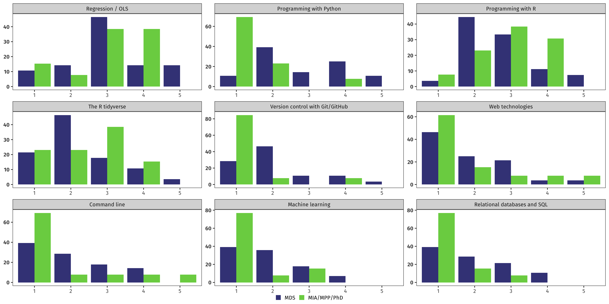
</div>


---
class: inverse, center, middle
name: whatisdatascience

# The MDS in a nutshell
<html><div style='float:left'></div><hr color='#EB811B' size=1px style="width:1000px; margin:auto;"/></html>


---
# Curriculum

.pull-left[
<div align="center">
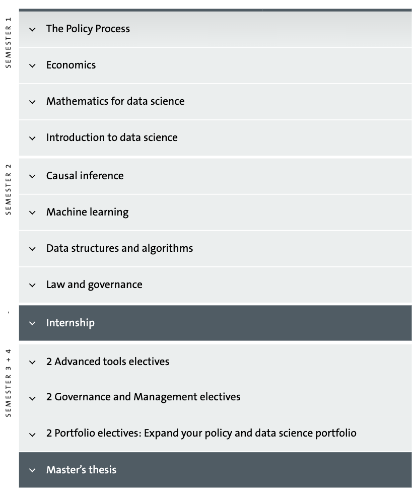
</div>
]

.pull-right[
]

---
# Curriculum

.pull-left[
<div align="center">
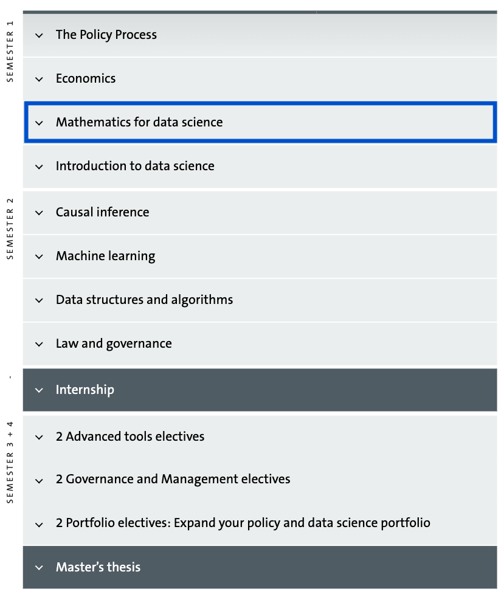
</div>
]

.pull-right[
<div align="center"><br><br><br><br><br>
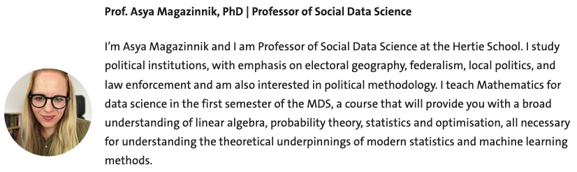
</div>
]


---
# Curriculum

.pull-left[
<div align="center">
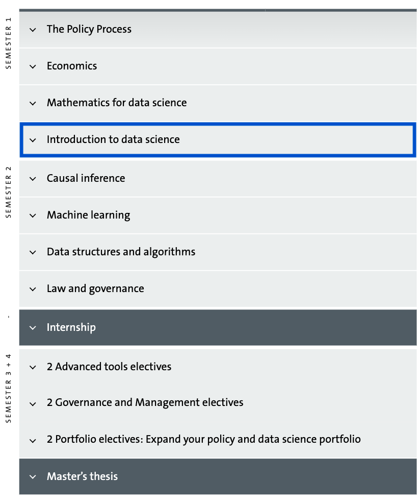
</div>
]

.pull-right[
<div align="center"><br><br><br><br><br>
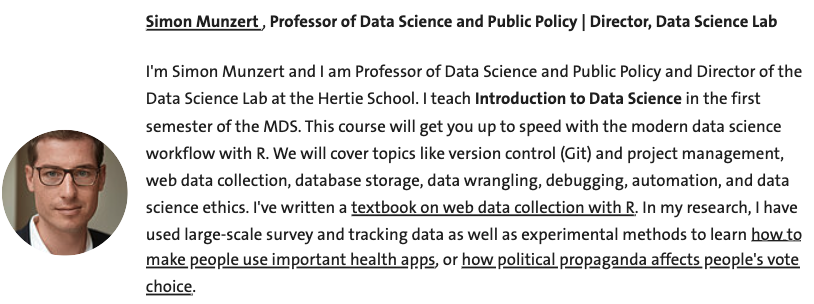
</div>
]


---
# Curriculum

.pull-left[
<div align="center">
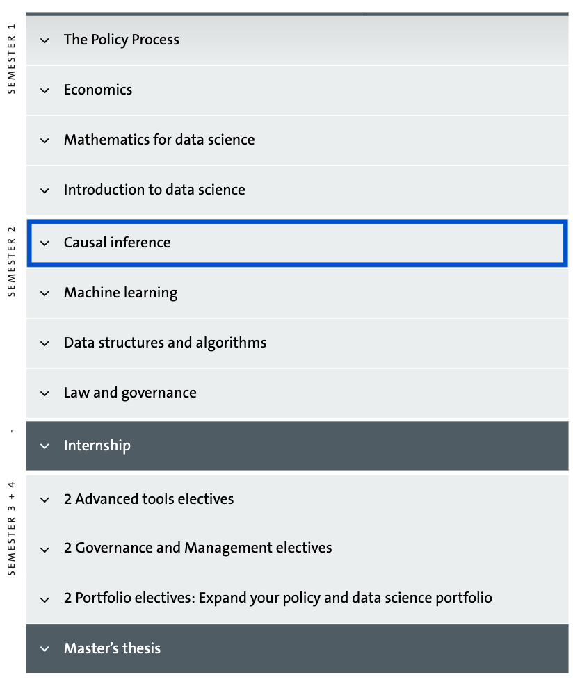
</div>
]

.pull-right[
<div align="center"><br><br><br><br><br>
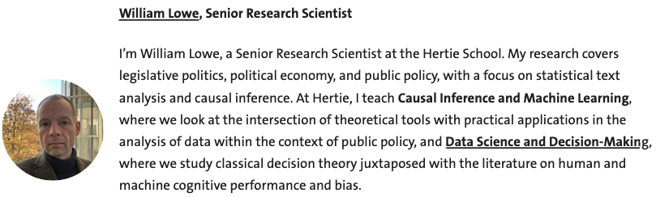
</div>
]


---
# Curriculum

.pull-left[
<div align="center">
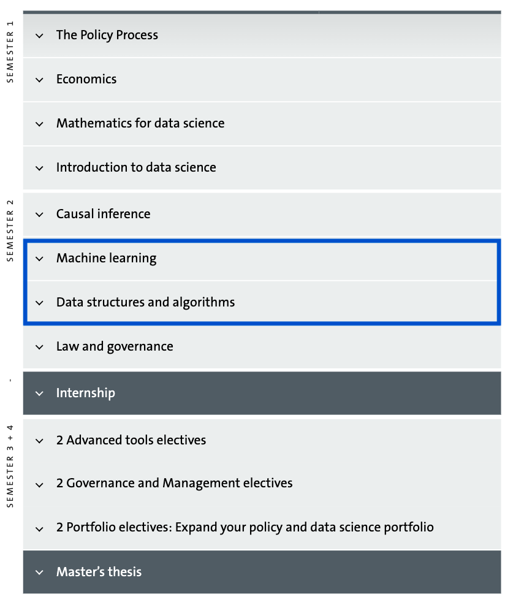
</div>
]

.pull-right[
<div align="center"><br><br><br><br><br>
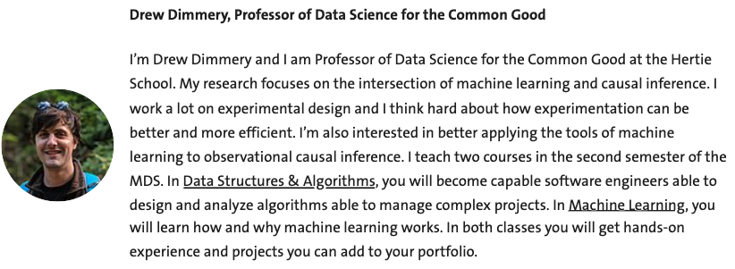
</div>
]


---
# Curriculum

.pull-left[
<div align="center">
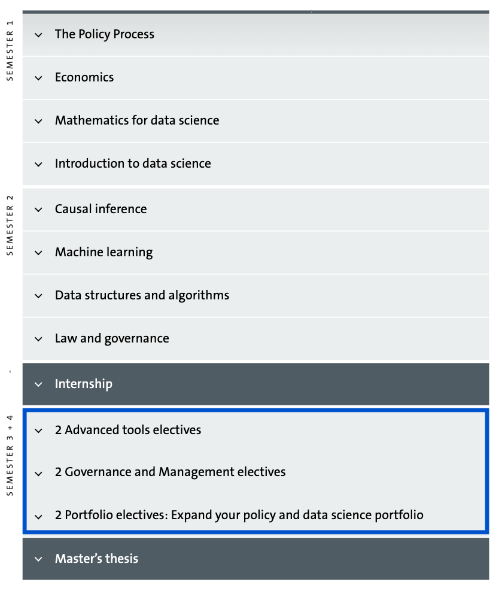
</div>
]

.pull-right[
<div align="center"><br><br><br><br><br>
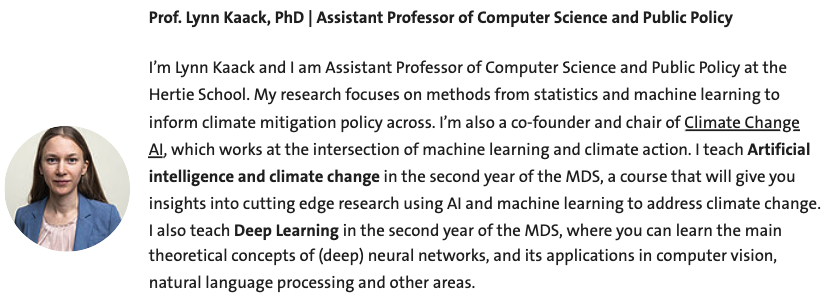
</div>
]


---
class: inverse, center, middle
name: whatisdatascience

# What is data science?
<html><div style='float:left'></div><hr color='#EB811B' size=1px style="width:1000px; margin:auto;"/></html>

---
# What is data science?


.pull-left[
## What is data science?

> "Data science is an **interdisciplinary academic field** that uses statistics, scientific computing, scientific methods, processes, algorithms and systems to extract or extrapolate knowledge and insights from potentially noisy, structured, or unstructured data." - [Wikipedia](https://en.wikipedia.org/wiki/Data_science)

> "Data science is a concept to **unify statistics, data analysis, informatics**, and their related methods to understand and analyze actual phenomena with data." - [Chikio Hayashi](https://www.springer.com/book/9784431702085) 

> "Data science encompasses a **set of principles**, problem definitions, algorithms, and processes for **extracting nonobvious and useful patterns from large data sets**." - [John Kelleher and Brendan Tierney](https://mrce.in/ebooks/Data%20Science.pdf)
]

--

.pull-right[
## A working definition

<div align="center"><br>
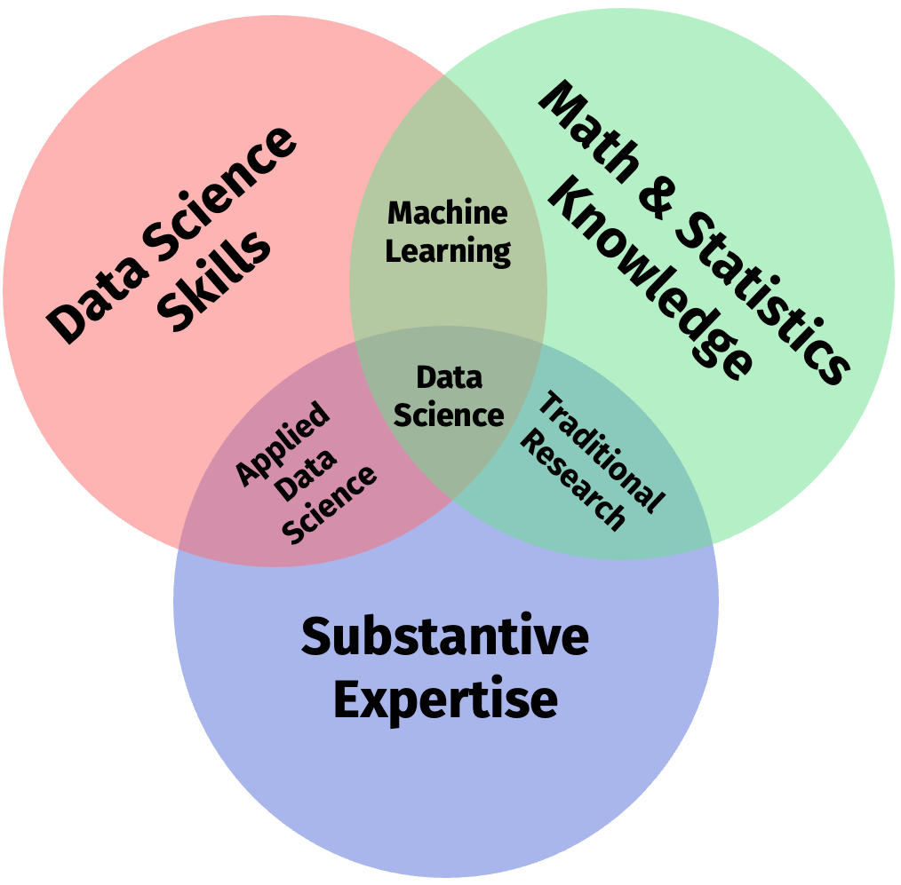
</div>

`Source` [Drew Conway, 2010](https://drewconway.com/zia/2013/3/26/the-data-science-venn-diagram) (adapted)
]


---
background-image: url("pics/vintage-pipeline.jpeg")
background-size: contain
background-color: #000000

# The data science pipeline


---
# The data science pipeline

.pull-left[

## Preparatory work

- **Problem definition** predict, infer, describe
- **Design** conceptualize, build data collection device
- **Data collection** recruit, collect, monitor

]

---
# The data science pipeline

.pull-left[
## Preparatory work

- **Problem definition** predict, infer, describe
- **Design** conceptualize, build data collection device
- **Data collection** recruit, collect, monitor

## Data operation
]

.pull-right-center[
<br><br><br>
<div align="center">

</div>

`Source` [H. Wickham, M. Çetinkaya-Rundel, G. Gronemund: R for Data Science](https://r4ds.hadley.nz/)
]

---
# The data science pipeline

.pull-left[
## Preparatory work

  - **Problem definition** predict, infer, describe
  - **Design** conceptualize, build data collection device
  - **Data collection** recruit, collect, monitor

## Data operation

   - **Wrangle**: import, tidy, manipulate
]

.pull-right-center[
<br><br><br>
<div align="center">

</div>

`Source` [H. Wickham, M. Çetinkaya-Rundel, G. Gronemund: R for Data Science](https://r4ds.hadley.nz/)
]


---
# The data science pipeline

.pull-left[
## Preparatory work

  - **Problem definition** predict, infer, describe
  - **Design** conceptualize, build data collection device
  - **Data collection** recruit, collect, monitor

## Data operation

   - **Wrangle**: import, tidy, manipulate
   - **Explore**: visualize, describe, discover
]

.pull-right-center[
<br><br><br>
<div align="center">

</div>

`Source` [H. Wickham, M. Çetinkaya-Rundel, G. Gronemund: R for Data Science](https://r4ds.hadley.nz/)
]


---
# The data science pipeline

.pull-left[
## Preparatory work

  - **Problem definition** predict, infer, describe
  - **Design** conceptualize, build data collection device
  - **Data collection** recruit, collect, monitor

## Data operation

   - **Wrangle**: import, tidy, manipulate
   - **Explore**: visualize, describe, discover
   - **Model**: build, test, infer, predict
]

.pull-right-center[
<br><br><br>
<div align="center">

</div>

`Source` [H. Wickham, M. Çetinkaya-Rundel, G. Gronemund: R for Data Science](https://r4ds.hadley.nz/)
]


---
# The data science pipeline

.pull-left[
## Preparatory work

  - **Problem definition** predict, infer, describe
  - **Design** conceptualize, build data collection device
  - **Data collection** recruit, collect, monitor

## Data operation

   - **Wrangle**: import, tidy, manipulate
   - **Explore**: visualize, describe, discover
   - **Model**: build, test, infer, predict

## Dissemination

  - **Communicate**: to the public, media, policymakers
  - **Publish**: journals/proceedings, blogs, software
  - **Productize**: make usable, robust, scalable
]

.pull-right-center[
<br><br><br>
<div align="center">

</div>

`Source` [H. Wickham, M. Çetinkaya-Rundel, G. Gronemund: R for Data Science](https://r4ds.hadley.nz/)
]


---
# The data science pipeline

.pull-left[
## Preparatory work

  - **Problem definition** predict, infer, describe
  - **Design** conceptualize, build data collection device
  - **Data collection** recruit, collect, monitor

## Data operation

   - **Wrangle**: import, tidy, manipulate
   - **Explore**: visualize, describe, discover
   - **Model**: build, test, infer, predict

## Dissemination

  - **Communicate**: to the public, media, policymakers
  - **Publish**: journals/proceedings, blogs, software
  - **Productize**: make usable, robust, scalable

**Meta skill: programming**
]

.pull-right-center[
<br><br><br>
<div align="center">
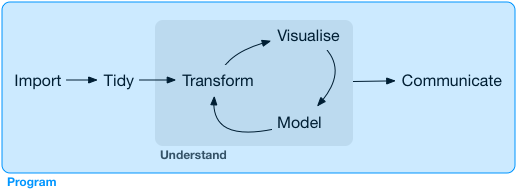
</div>

`Source` [H. Wickham, M. Çetinkaya-Rundel, G. Gronemund: R for Data Science](https://r4ds.hadley.nz/)
]


---

# The data science pipeline

.pull-left[

## Preparatory work

  - **Problem definition** predict, infer, describe
  - **Design** conceptualize, build data collection device
  - **Data collection** recruit, collect, monitor

## Data operation

   - **Wrangle**: import, tidy, manipulate
   - **Explore**: visualize, describe, discover
   - **Model**: build, test, infer, predict

## Dissemination

  - **Communicate**: to the public, media, policymakers
  - **Publish**: journals/proceedings, blogs, software
  - **Productize**: make usable, robust, scalable

**Meta skill: programming with R (and Python!)**
]

.pull-right-center[
<br><br>
<div align="center">

</div>
]


---
class: inverse, center, middle
name: preview

# Sneak preview
<html><div style='float:left'></div><hr color='#EB811B' size=1px style="width:1000px; margin:auto;"/></html>

---

# Introduction to Data Science in a nutshell

<div align="center">
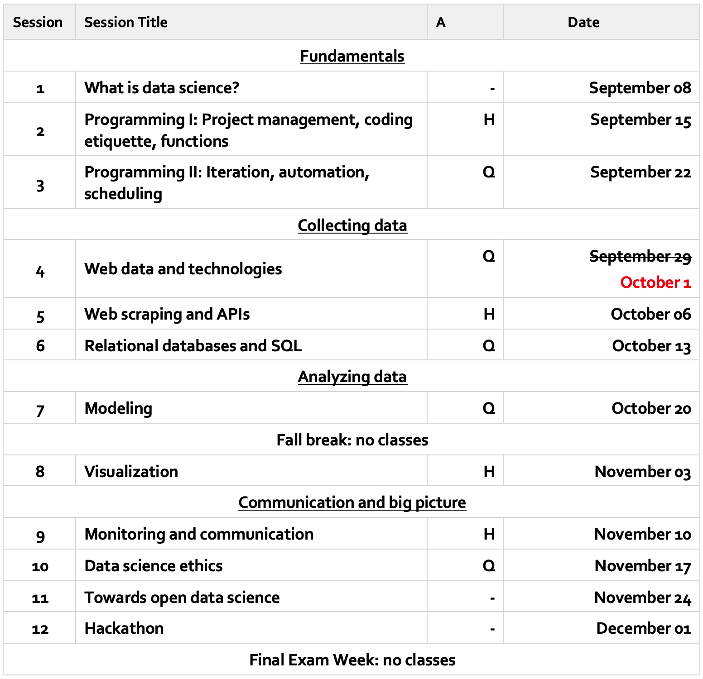
</div>


---
class: inverse, center, middle

# Sneak preview <br> Learning to love a programming environment

<html><div style='float:left'></div><hr color='#EB811B' size=1px style="width:1000px; margin:auto;"/></html>


---
class: center
background-color: #fff

# The tidyverse

<div align="center">
<br>
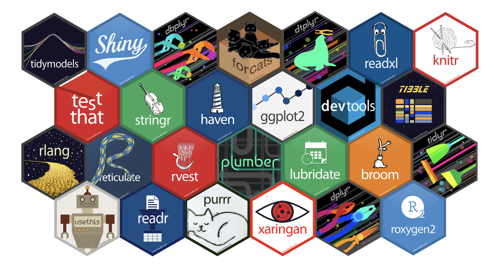
</div>


---
# Why R and RStudio? (cont.)

```{R, indeeddotcom, echo = F, fig.height = 5, fig.width = 9, dev = "svg", warning = F}
# The popularity data
pop_df = 
  data.frame(
  lang = c("Python", "SQL", "R", "SAS", "Matlab", "Julia", "SPSS", "Stata"),
  #n_jobs = c(6850, 6136, 4384, 551, 537, 249, 110, 60), # 2024/09/01 -> not possible anymore - they don't provide precise numbers!
  n_jobs = c(6850, 6136, 4384, 551, 537, 249, 110, 60), # 2023/09/01
  #n_jobs = c(12203, 10291, 6812, 1005, 838, 474, 296, 67), # 2022/09/03
  #n_jobs = c(8150, 7264, 3484, 950, 687, 270, 74), # 2021/08/27
  #n_jobs = c(99756, 132860, 41242, 31943, NA, 4843, 2302),
  free = c(T, T, T, F, F, T, F, F)
  )
## Plot it
pop_df %>% 
  mutate(lang = lang %>% factor(ordered = T)) %>%
  ggplot(aes(x = lang, y = n_jobs, fill = free)) +
  geom_col() +
  geom_hline(yintercept = 0) +
  aes(x = reorder(lang, -n_jobs), fill = reorder(free, -free)) +
  xlab("Statistical language") +
  scale_y_continuous(label = scales::comma) +
  ylab("Number of jobs") +
  labs(
    title = "Comparing statistical languages",
    subtitle = "Number of job postings for '<language> data' on de.indeed.com"
    ) +
  scale_fill_manual(
    "Free of charge?",
    labels = c("True", "False"),
    values = c("#f92672", "darkslategray")
    ) +
  ggthemes::theme_pander(base_size = 17) +
  # theme_ipsum() +
  theme(legend.position = "none")
```


---
# AI use in and for the course

.pull-left-vwide[

### Can AI tools (LLM-based coding assistants) be used for assignments?

Yes, but use them with care. You will not become an efficient programmer if you heavily rely on those tools without learning the basics.

<div align="center">
<br>
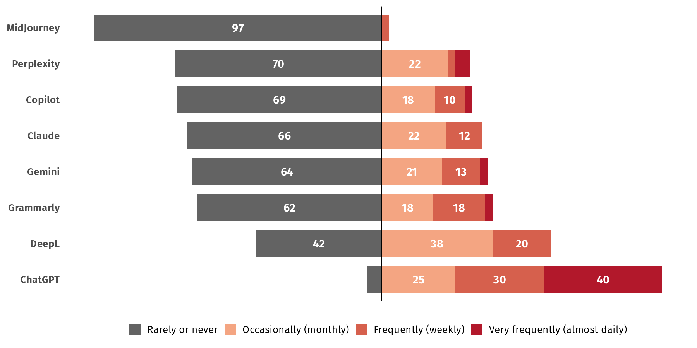
<br>
</div>
]

.pull-right-vsmall[
<div align="center">
<br>

<br><br>

<br><br>
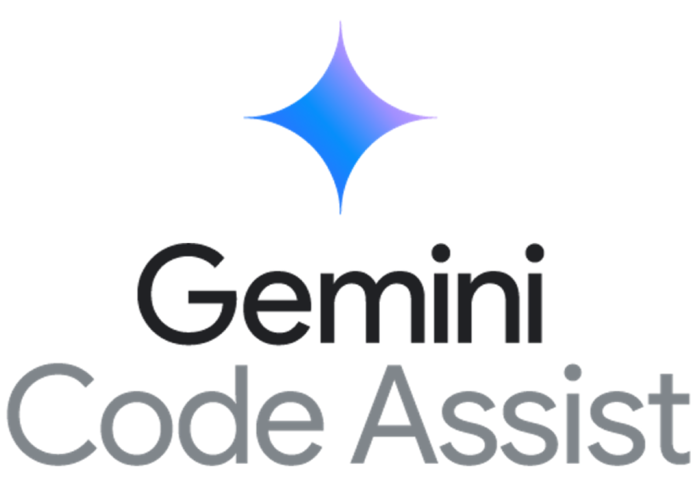
<br><br>
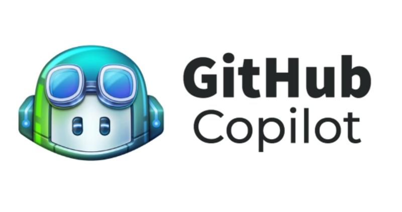
<br>
</div>
]


---
# AI use in and for the course

.pull-left-vwide[

### *Should* you use AI tools for this course?

- You are a student at one of the leading policy schools in the world. You decided to invest a considerable amount of time and money to learn about data science and public policy here. I think you're at the right place to do so.
- However, the learning is still on you. What is key is that you want to *understand* what you are doing. That will require you to think hard and work hard. And that is ultimately what you need to excel in a data-based job.
- Or, you could just rely on some commercial language model to do the hard work for you. If you do that, you will notice that the muscles you wanted to train will not grow.
- That is not to say that AI is not useful for coding. It is incredibly powerful. But it also often fails spectacularly. You need to understand what is going on under the hood to make it work for you.
- I am not here to discipline and punish. I have no interest in that. What I can do is provide you with an environment that facilitates learning and sets the right incentives. If you want to learn, I will help you. If you don't, I can't.
]

.pull-right-vsmall[
<div align="center">
<br>

<br><br>

<br><br>

<br><br>

<br>
</div>
]


---
class: inverse, center, middle

# Sneak preview <br> Collecting web data at scale

<html><div style='float:left'></div><hr color='#EB811B' size=1px style="width:1000px; margin:auto;"/></html>


---
# The MIT Billion Prices Project

.pull-left[
<div align="center">

</div>
]

.pull-right[
<div align="center">
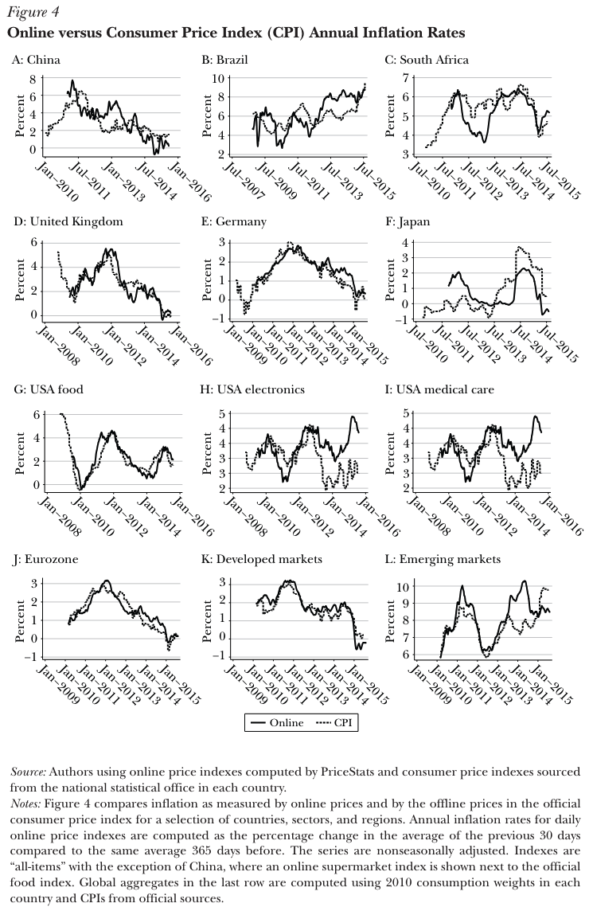
</div>
]

<br>
**See also:** [https://thebillionpricesproject.com/](https://thebillionpricesproject.com/) and [https://www.pricestats.com/](https://www.pricestats.com/)

---
# The MIT Billion Prices Project

.pull-left[
<div align="center">

</div>
]

.pull-right[
<div align="center">

</div>
]

<br>
**See also:** [https://thebillionpricesproject.com/](https://thebillionpricesproject.com/) and [https://www.pricestats.com/](https://www.pricestats.com/)


---
class: inverse, center, middle

# Sneak preview <br> Reflecting everyday ethics in data science

<html><div style='float:left'></div><hr color='#EB811B' size=1px style="width:1000px; margin:auto;"/></html>

---
class: center
background-image: url("pics/webscraping2.jpeg")
background-size: contain

# How do I respect intellectual property?


---
class: center
background-image: url("pics/versioncontrol.jpeg")
background-size: contain
background-color: #000000

# How do I ensure an open science workflow?


---
class: center
background-image: url("pics/meeting-presentation.png")
background-size: contain
background-color: #000000

# How do I communicate results honestly?


---
# Summary

.pull-left[

### Goals of the course

- This course equips you with conceptual knowledge about the data science pipeline and coding workflow, data structures, and data wrangling.
- It enables you to apply this knowledge with statistical software.
- It prepares you for our other core courses and electives as well as the master’s thesis.

<div align="center">
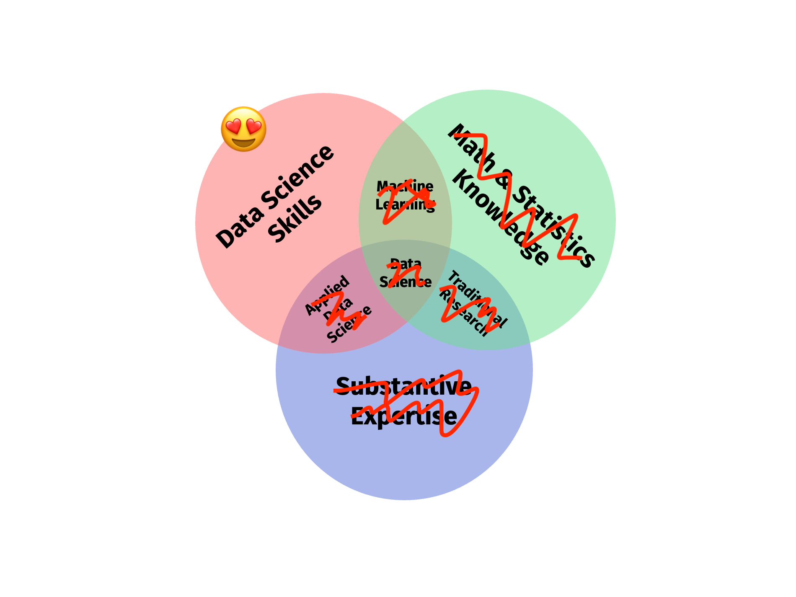
</div>

]


.pull-right[
### What we will cover

- Version control and project management
- R and the tidyverse
- Programming workflow: debugging, automation, packaging
- Relational databases and SQL
- Web data and technologies
- Model fitting and evaluation
- Viusalization
- Monitoring and communication
- Data science ethics
- (The command line)

]


---
background-image: url("pics/harry-ron-hermione-start.jpeg")
background-size: contain
background-color: #000000

# You at the beginning of the course


---
background-image: url("pics/harry-ron-hermione-end.jpeg")
background-size: contain
background-color: #000000

# You at the end of the course


---
# Core (and optional) readings

<br><br><br>
<div align="center">
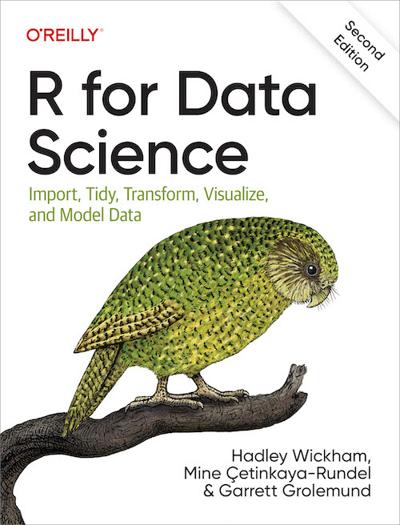

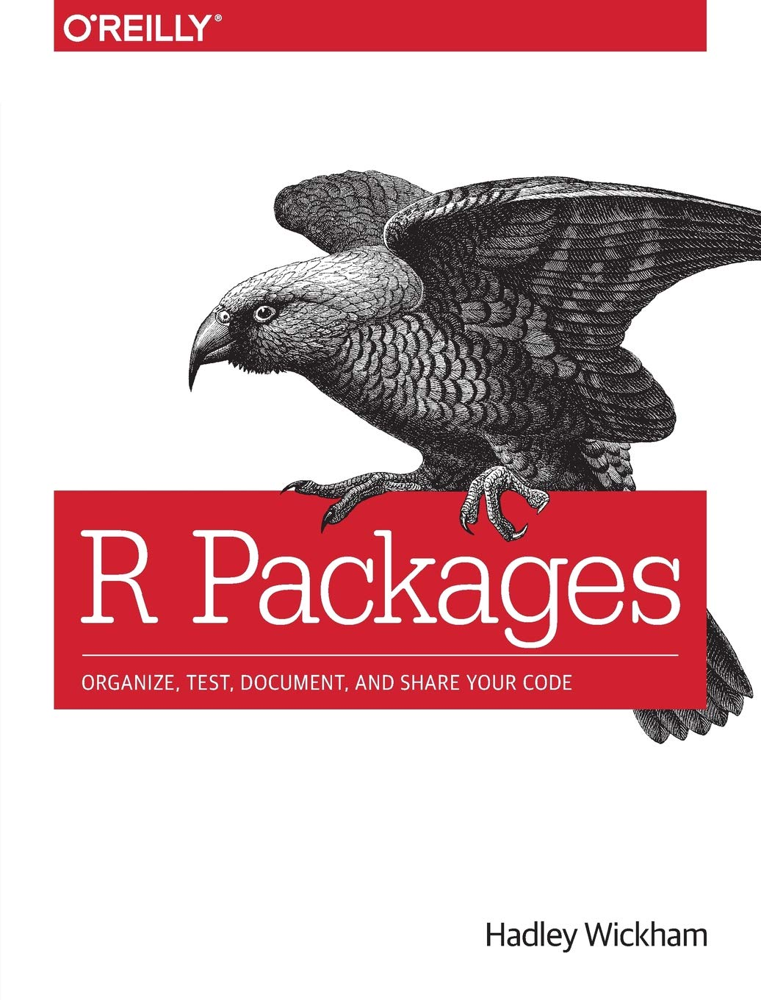


</div>


---
# Further reading

<div align="center">


<br>
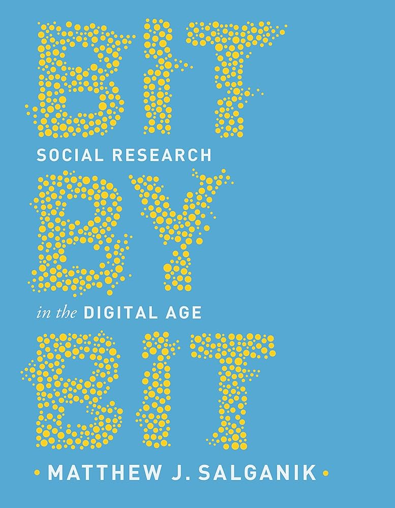


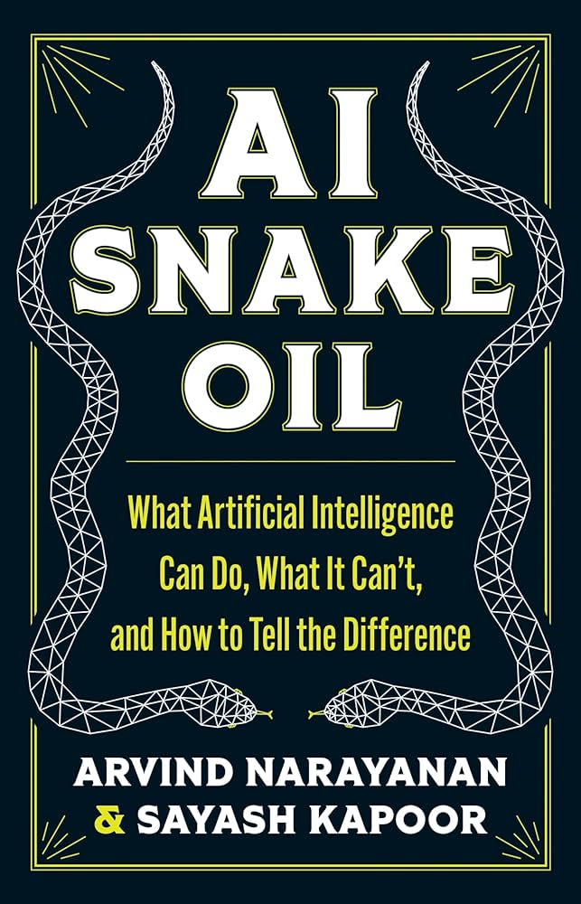
</div>


---
# Further listening

<div align="center">
<br><br><br>


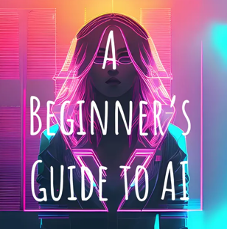


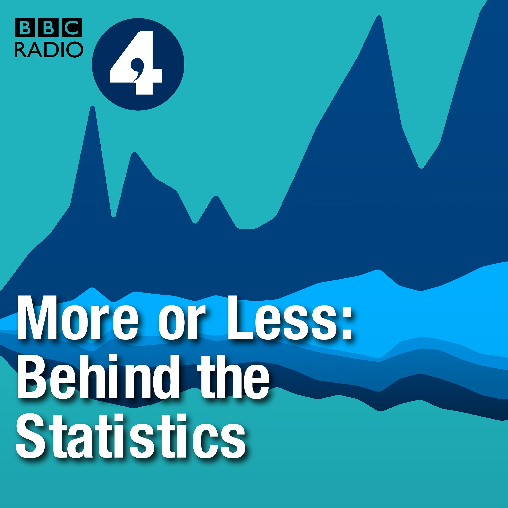
<br>
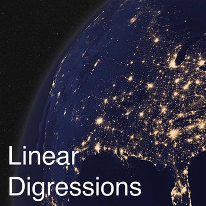

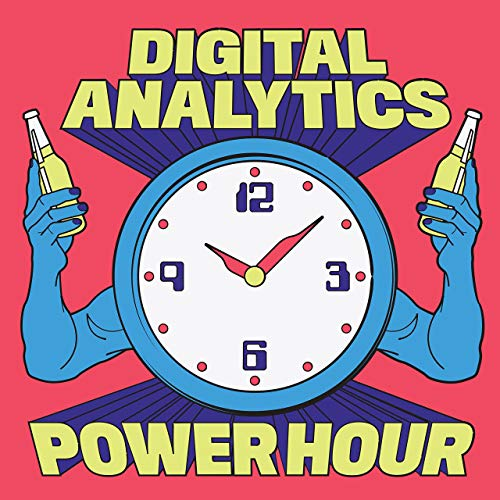
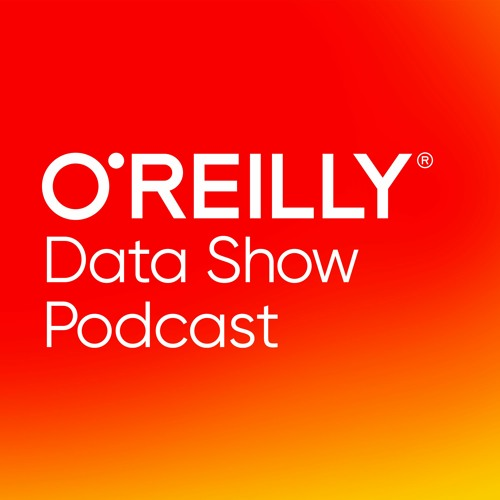

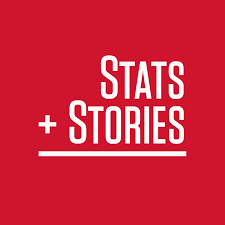
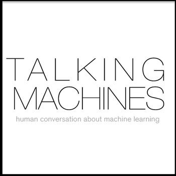
</div>


---
background-image: url("pics/final-picture.png")
background-size: contain
background-color: #000000

# We look forward to welcoming you in Berlin in Fall!


